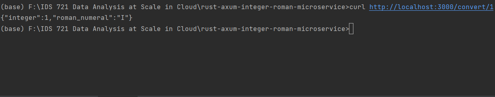

## Containerization Process Writeup for the Rust Axum Integer to Roman Microservice

This document details the process of containerizing a Rust Axum microservice designed to convert integers to Roman numerals. The process encompasses creating a Dockerfile, building a Docker image, and running the container locally.

**1. Project Overview**

The project is a microservice developed with the Rust programming language and the Axum framework. It accepts integers via HTTP requests and returns their Roman numeral representation. This functionality is encapsulated in a lightweight and efficient web service.

**2. Creating the Dockerfile**

The first step in containerization is crafting a Dockerfile. This file instructs Docker on how to build an image containing everything needed to run the microservice, including the Rust environment, project code, and dependencies.

```Dockerfile
# Use the official Rust image as the build environment
FROM rust:1.67 as builder
WORKDIR /app
COPY . .
# Build the application
RUN cargo build --release

# Use a minimal runtime image to reduce the final image size
FROM debian:buster-slim
COPY --from=builder /app/target/release/myapp /usr/local/bin/
# Specify the command to run on container startup
CMD ["myapp"]
```
This document details the process of containerizing a Rust Axum microservice designed to convert integers to Roman numerals. The process encompasses creating a Dockerfile, building a Docker image, and running the container locally.

**3. Building the Docker Image**

With the Dockerfile in place, the next step is to build the Docker image. This is done by executing the following command in the root directory of the project:
```Dockerfile
docker build -t rust-axum-integer-roman .
```
This command constructs a Docker image named 'rust-axum-integer-roman' that contains the Rust Axum application, ready to be run in a containerized environment.

**4. Running the Container Locally**

Once the image is built, the container can be run locally using the command:
```Dockerfile
docker run -p 3000:3000 rust-axum-integer-roman
```
This command starts a container instance and maps the container's internal port 3000 to port 3000 on the host, allowing the microservice to be accessed via http://localhost:3000.

**5. Testing and Verification**

The final step is to ensure that the microservice functions correctly within the container. This can be done by sending HTTP requests to http://localhost:3000/convert/{number}, where {number} is the integer you wish to convert to Roman numerals. The response should be verified for correctness.

## Screenshot showing container running
